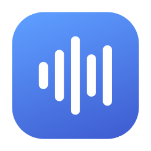
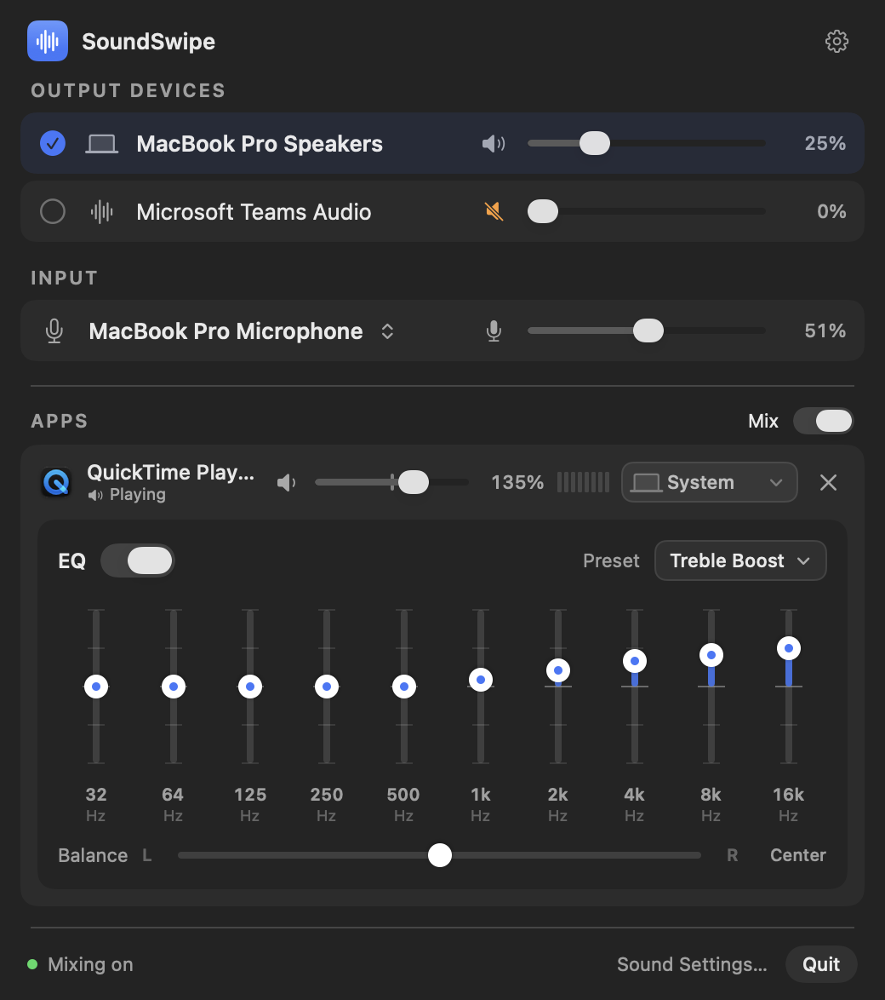
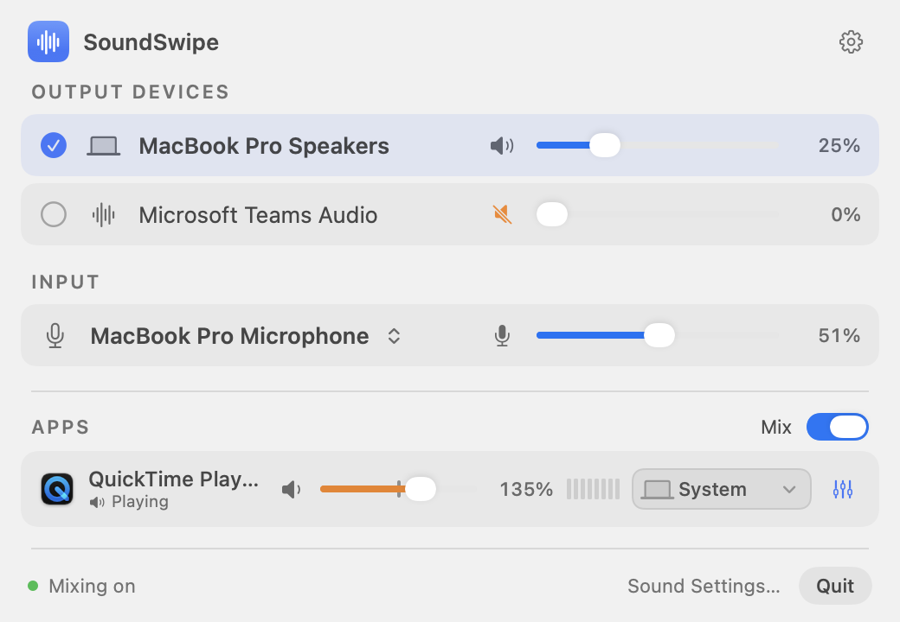
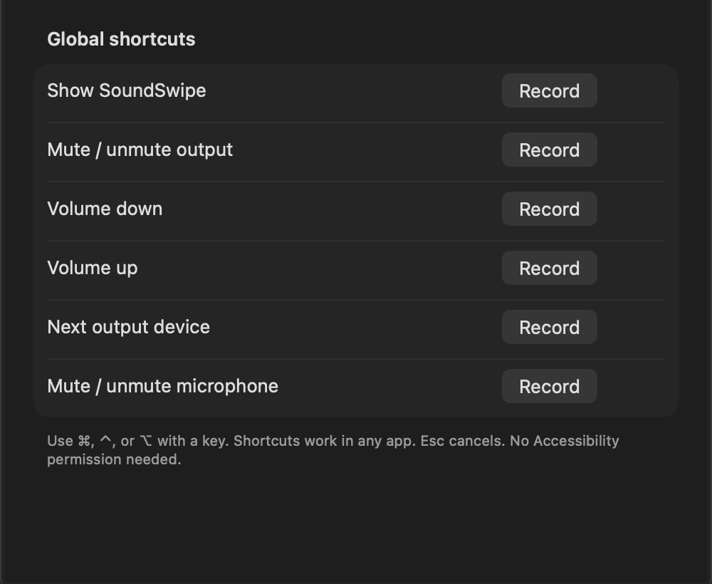

<p align="center">
  
</p>

<h1 align="center">SoundSwipe</h1>

<p align="center"><b>A little more control over your Mac’s audio.</b><br>
Per-app volume, 10-band EQ, boost, and output routing — from a tiny native menu bar app.</p>

<p align="center">
  <a href="https://github.com/Hiteshldt/soundswipe/actions/workflows/ci.yml"></a>
  <a href="https://github.com/Hiteshldt/soundswipe/releases"></a>
  
  <a href="LICENSE"></a>
</p>

SoundSwipe is a free, open-source macOS menu bar app for output and input control, individual app volumes, volume boost, and per-app audio routing — an alternative in the spirit of [Background Music](https://github.com/kyleneideck/BackgroundMusic) and [SoundSource](https://rogueamoeba.com/soundsource/). It is built with SwiftUI, AppKit, Core Audio, and a tiny C audio kernel: a ~3 MB universal app with no Electron, package dependencies, account, telemetry, or network access.

> **Preview:** device controls and the interface are implemented and tested. Per-app mixing uses Apple’s Core Audio process taps and still needs wider validation across hardware and macOS releases. Preview builds are not yet notarized.

<p align="center"></p>

## Features

- **Menu bar panel** with native materials, light/dark appearance, and VoiceOver labels.
- **See which apps are using audio.** Only apps that are playing sound or using the microphone appear, with a live *Playing* / *Mic* status. Helper processes (like a browser's audio helper) are grouped under their app, and separately running copies of the same app get their own rows.
- **Microphone in-use indicator** showing which apps are listening, plus one-click microphone mute (and a shortcut for it).
- **All output devices at a glance** — switch with one click and set each device's volume independently, with device icons (AirPods, headphones, speakers, TV). Fixed-volume devices are labeled.
- **Microphone switching**, input level, and mute.
- **Per-app volume from 0–200%.** Boost above 100% passes through a soft limiter so it never hard-clips; at or below 100% audio is untouched.
- **Per-app 10-band EQ** (32 Hz–16 kHz, ±12 dB) with an on/off switch and 16 presets (Bass Boost, Vocal Booster, Spoken Word, Rock, Small Speakers…), plus left/right balance.
- **Per-app output routing** — send music to headphones while calls stay on speakers. No driver or kernel extension to install.
- **Live segmented level meters** for every adjusted app (only while the panel is open), and a 100% marker on each app's slider.
- **Scroll on the menu bar icon** to change volume; the icon shows when output is muted. **Right-click** for a quick menu with output devices, mute, and Mix apps.
- **Global keyboard shortcuts** you record yourself: show panel, mute, volume up/down, next output, mute microphone. No Accessibility permission needed.
- **Remembers your mix** per app; disconnected routes fall back to the current output. Optionally turns mixing on at launch, and restores it after sleep.
- **Launch at login.**
- **Lightweight by design:** ~0% CPU and ~14 MB memory when idle. Activity checks and meters run only while the panel is open, and audio routes exist only for apps you have changed.

<p align="center">
  
  
</p>

## Install

1. Download `SoundSwipe.zip` from the [latest release](https://github.com/Hiteshldt/soundswipe/releases) and move **SoundSwipe.app** to Applications.
2. Preview builds are not notarized yet. On first launch macOS will block the app; open **System Settings → Privacy & Security** and click **Open Anyway**. Or build it yourself (below).

Requires **macOS 14.2 or newer**, Apple Silicon or Intel.

## Use

1. Click the waveform in the menu bar. Pick a speaker/headphone or microphone.
2. Play sound in any app — it appears under **Apps**. Drag its slider, pick an output from its device menu, or open the EQ button for the 10-band equalizer and balance.
3. Allow system-audio access when macOS asks (first adjustment only). Audio is processed locally and never saved or sent anywhere.
4. Open the gear for shortcuts, launch at login, and turning mixing on at launch.
5. Turn off **Mix** to hand every app back to normal macOS playback instantly.

System controls do not need any permission. Changing the system output changes the default device; apps with their own in-app route may keep using it.

## Build from source

```sh
git clone https://github.com/Hiteshldt/soundswipe.git
cd soundswipe
./scripts/test.sh
./scripts/build.sh            # or --universal for Intel + Apple Silicon
open dist/SoundSwipe.app
```

Needs Swift 5.10+ (Xcode 16+ or the Command Line Tools). You can also open `Package.swift` in Xcode. Run the **bundled app** from `dist/` to test permissions and login items; `swift run` lacks the bundle metadata macOS requires.

## Current limits

- Mixing handles stereo, 32-bit float PCM routes; other layouts stop mixing and report an error. No recording or Audio Unit plug-ins yet.
- Microphone use is shown per app, but macOS does not allow per-app microphone volume; mute and level apply to the whole input device.
- Helper processes are grouped only through their verified parent app; system services (for example WebKit media) keep the name macOS reports.
- **Browser tabs and windows cannot be controlled separately.** Chrome, Edge, Brave, Electron apps, and Safari mix every tab and window inside one shared audio process before macOS receives it, so no Mac audio utility can split them. Use the browser's own tab mute, or run a second browser instance/profile — each running copy gets its own row.
- Some protected content cannot be captured, and conferencing apps or Bluetooth call profiles need more hardware testing.
- SoundSwipe is a menu bar app, not a Control Center module. No automatic updater yet.

See [architecture](docs/ARCHITECTURE.md), [validation](docs/TESTING.md), the [roadmap](docs/ROADMAP.md), and the [changelog](CHANGELOG.md).

## Contributing

Issues and pull requests are welcome — read [CONTRIBUTING.md](CONTRIBUTING.md). Report security issues privately as described in [SECURITY.md](SECURITY.md).

SoundSwipe is original code inspired by Background Music and SoundSource; it includes none of their code or assets and is not affiliated with either. Audio routing uses Apple’s [Core Audio process taps](https://developer.apple.com/documentation/coreaudio/capturing-system-audio-with-core-audio-taps).

## License

[MIT](LICENSE) · Made by Hitesh Gupta · [GitHub](https://github.com/Hiteshldt) · [X](https://x.com/hit3sh3d) · [ayuvam.com](https://ayuvam.com)
