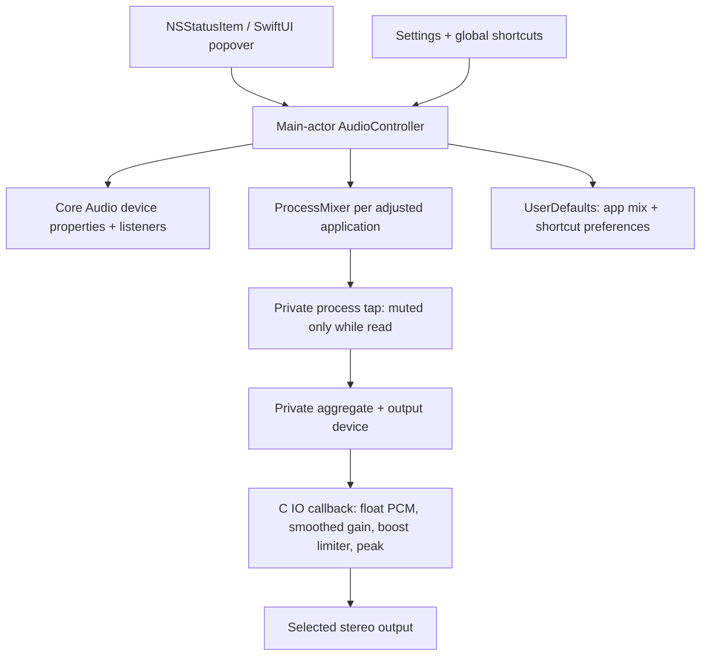

# Architecture

## Boundaries

- `AudioHardware.swift`: typed Core Audio property access, device discovery, listener lifetime.
- `ProcessMixer.swift`: process discovery and ownership of a tap, aggregate device, IOProc, and DSP state.
- `AudioDSP`: a small real-time C callback. No Swift/Objective-C calls, allocations, locks, UI work, logging, or filesystem access in render. Gain and peak transfer through lock-free atomics. A one-pole gain ramp avoids abrupt slider transitions. Gain is clamped to 0–2×; above unity a tanh soft knee (from 0.8 full scale) keeps output below 1.0, while unity and lower gain are bit-transparent. The reported peak is post-gain, so meters show what the listener hears.
- `AudioController.swift`: main-actor state, device-change reconciliation, user intent, cleanup, errors. Core Audio notifications drive device refresh; a one-second health timer exists only while mixing is enabled. `LevelMeters` is a separate observable so 20 Hz meter updates redraw only meter views; its timer runs only while the panel is visible and mixing is on. Mixing stops before sleep and, if it was on, is rebuilt two seconds after wake.
- `Preferences.swift`: persisted mix and shortcut values. Hardware IDs are ephemeral; device UIDs persist in saved routes. Profile URLs are restricted to intended HTTPS hosts.
- `Shortcuts.swift`: Carbon registered hotkeys; no keyboard event tap or Accessibility entitlement. NSEvent observes local keypresses only while recording a shortcut in Settings.
- `UI`: native SwiftUI controls and materials, using NSStatusItem and NSPopover for menu bar placement. The status item handles left-click (panel), right-click (quick NSMenu), and scroll (output volume via a local event monitor on the app's own status window).

## Audio lifecycle

Unadjusted apps use their normal audio path. An adjustment creates a private tap with `mutedWhenTapped`; a private aggregate combines the tap with a physical stereo output. The IOProc reads captured PCM, smooths the target gain, and writes to the output. The app does not change the system default device to its private aggregate.

Stop order is IOProc stop → IOProc destroy → aggregate destroy → tap destroy → C state free. Partially completed setup follows the same cleanup path. The tap’s conditional muting avoids permanently muting an app when the tap is not being read. Runtime errors stop all mixers and surface an actionable message. Hardware loss falls back to the default route if one exists. Process exit removes its mixer.

System-level Core Audio permissions can return silent audio for restricted sources. A zero signal alone cannot distinguish silence from permission denial, so SoundSwipe does not claim that silence proves a healthy route.

## Resource model

There is no web runtime, third-party dependency, server, launch daemon, custom driver, automatic updater, or continuous device polling. Normal device controls use Core Audio notifications. There is one aggregate/callback per adjusted app, so mixing cost grows with the number of controlled apps. The health timer is intentionally low-frequency; it is not an audio meter.

## Privacy and distribution

Audio stays in memory and is sent to a local selected device. There is no recording or network path. Only mixes, shortcuts, and profile overrides are stored in UserDefaults. This build is not App Sandbox enabled; process-tap access is mediated by macOS privacy controls. For public distribution use Developer ID signing, hardened runtime, and notarization. No unsupported OS injection or private UI API is used.
